<p align="center">
  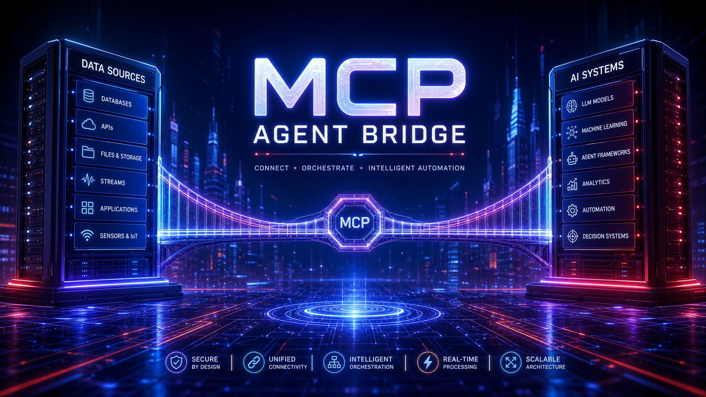
</p>

# MCP Agent Bridge

> 🚀 A lightweight **agent gateway** that combines multiple local **MCP servers** into a single **MCP endpoint** — with **runtime control**, **hot-reloadable configuration**, and a powerful **`bridge__execute`** tool that lets you call any child server tool without restarting.

<p align="center">
  
  
  
  
  
</p>

---

## ✨ What's new in v0.3.0

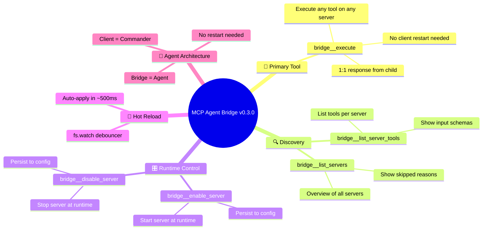

**No restarts. No external edits. Just call `bridge__execute`.**

---

## 📖 Table of contents

- [Overview](#-overview)
- [Why this project exists](#-why-this-project-exists)
- [Architecture](#-architecture)
- [Bridge meta tools](#-bridge-meta-tools)
- [Examples](#-examples)
- [Project structure](#-project-structure)
- [Quick start](#-quick-start)
- [CLI usage](#-cli-usage)
- [Configuration format](#-configuration-format)
- [Endpoints](#-endpoints)
- [Security notes](#-security-notes)
- [Troubleshooting](#-troubleshooting)
- [Design principles](#-design-principles)

---

## 🌍 Overview

`MCP Agent Bridge` is an **agent gateway** that turns multiple local MCP servers into one clean remote-facing MCP endpoint.

Instead of exposing or managing each MCP server separately, this bridge:

- 📖 reads a standard `mcpServers` JSON config
- 🎯 starts only the servers you want
- 🔗 aggregates their tools
- 🏷️ prefixes tool names by source server
- 🛰️ exposes its own meta tools for runtime inspection & control
- 🌐 exposes everything through a single `/mcp` endpoint
- 🚀 provides `bridge__execute` to call any child server tool **without client restart**

---

## 🧩 Why this project exists

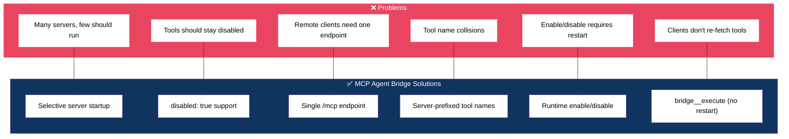

`MCP Agent Bridge` solves those problems with a small, explicit, easy-to-debug layer — **including runtime enable/disable without restarts**.

---

## 🏗️ Architecture

### The Agent-Commander Pattern

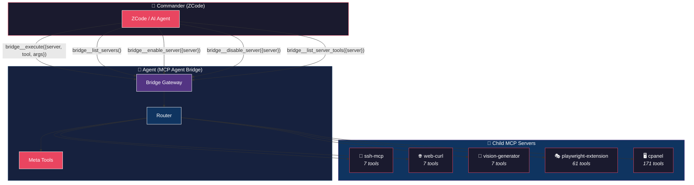

### Key idea

The bridge is the **agent** that manages all child server sessions. The client (ZCode) is the **commander** that sends instructions through `bridge__execute`.

**Benefits:**
- ✅ Client only needs to know 5 meta tools (not hundreds of child tools)
- ✅ Enable/disable servers without client restart
- ✅ Response is 1:1 from child server (no data transformation)
- ✅ All session management happens inside the bridge

### Request flow

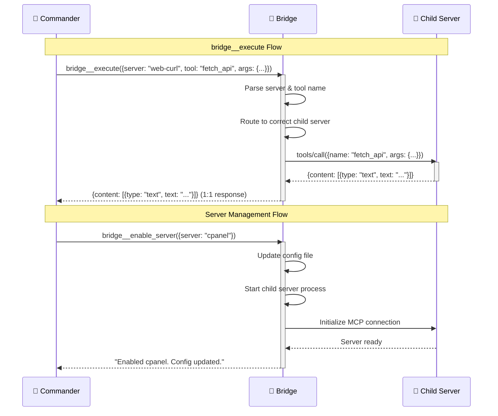

### Enable/Disable flow

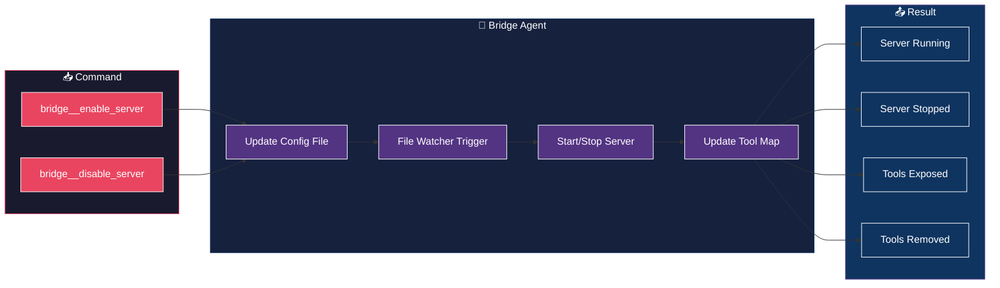

---

## 🛰️ Bridge meta tools

The bridge exposes **5 tools at the gateway level** (prefix `bridge__`) that are the **only** tools AI clients see. Child server tools are intentionally hidden from `tools/list` — clients must go through `bridge__execute` to reach them. This keeps the bridge as the single point of contact and gives a clean **1:1 contract between AI and bridge**: one command in, one (possibly batched) result out.

### `bridge__execute` 🚀

**The primary way to interact with child MCP servers.** Everything AI wants to do goes through this tool.

The response is returned **exactly as-is** from the child server (1:1 output). The bridge is a thin pass-through.

**Supports two modes:**

#### Single mode

Call one tool:

```json
{
  "server": "web-curl",
  "tool": "fetch_api",
  "args": {
    "url": "https://api.example.com/data",
    "method": "GET",
    "limit": 1000
  }
}
```

**Args:**

| Field | Type | Required | Description |
|---|---|---|---|
| `server` | string | ✅ | Name of the MCP server (e.g. `"ssh-mcp"`, `"web-curl"`, `"playwright-extension"`) |
| `tool` | string | ✅ | Name of the tool to execute (e.g. `"terminal-start"`, `"fetch_api"`) |
| `args` | object | ❌ | Arguments to pass to the tool. Use `{}` for tools with no required parameters |

#### Batch mode

Chain multiple tool calls in **one** request. Each operation runs sequentially against its target server. Use this for workflows like `navigate → snapshot → evaluate` that would otherwise need N round trips.

```json
{
  "operations": [
    {
      "server": "playwright-extension",
      "tool": "browser_navigate",
      "args": { "url": "https://example.com" }
    },
    {
      "server": "playwright-extension",
      "tool": "browser_snapshot"
    },
    {
      "server": "playwright-extension",
      "tool": "browser_evaluate",
      "args": { "function": "() => document.body.innerText" }
    }
  ],
  "stopOnError": true
}
```

**Batch args:**

| Field | Type | Required | Description |
|---|---|---|---|
| `operations` | array | ✅ | Ordered list of `{ server, tool, args }` to execute sequentially |
| `stopOnError` | boolean | ❌ | If `true` (default), stop at the first failure. If `false`, attempt every operation and report per-op status |

**Batch response:**

```json
{
  "mode": "batch",
  "total": 3,
  "completed": 3,
  "stoppedOnError": false,
  "results": [
    { "index": 0, "server": "playwright-extension", "tool": "browser_navigate", "ok": true, "result": {...} },
    { "index": 1, "server": "playwright-extension", "tool": "browser_snapshot", "ok": true, "result": {...} },
    { "index": 2, "server": "playwright-extension", "tool": "browser_evaluate", "ok": true, "result": {...} }
  ]
}
```

**More single-mode examples:**

```json
// List models from vision-generator
{ "server": "vision-generator", "tool": "list_models" }

// Start SSH terminal
{ "server": "ssh-mcp", "tool": "terminal-start", "args": { "account": "rayhan-vps" } }

// Generate an image
{ "server": "vision-generator", "tool": "generate_image", "args": { "model": "gpt-image-2", "prompt": "A cat" } }

// Take a screenshot
{ "server": "playwright-extension", "tool": "browser_take_screenshot", "args": { "type": "png" } }
```

### `bridge__list_server_tools` 🔍

List all available tools for a specific MCP server, including their input schemas. Use this to discover what tools and parameters a server supports before calling `bridge__execute`.

**Args:**

| Field | Type | Required | Description |
|---|---|---|---|
| `server` | string | ✅ | Name of the MCP server to list tools for |

**Output:** JSON object with server name, tool count, and array of tools with names, descriptions, and input schemas.

### `bridge__list_servers` 🛰️

Get a complete overview of what the bridge is currently exposing.

**Args (optional):**

| Field | Type | Description |
|---|---|---|
| `server` | string | Filter to a specific server name (exact match) |

**Output:** Plain text summary including:
- Loaded servers with tool counts
- Skipped servers with reasons
- Total exposed tool count
- Full list of exposed tool names

### `bridge__disable_server` 🔒

Disable a server at runtime. The change is **persisted to the config file** — it survives restarts.

**Args:**

| Field | Type | Required | Description |
|---|---|---|---|
| `server` | string | ✅ | Name of the server entry in `mcpServers` |

### `bridge__enable_server` 🔓

Re-enable a previously disabled server. The change is **persisted to the config file**.

**Args:**

| Field | Type | Required | Description |
|---|---|---|---|
| `server` | string | ✅ | Name of the server entry in `mcpServers` |

---

## 🏷️ Tool naming strategy

Every tool is prefixed with its source server. Bridge meta tools use the `bridge__` prefix.

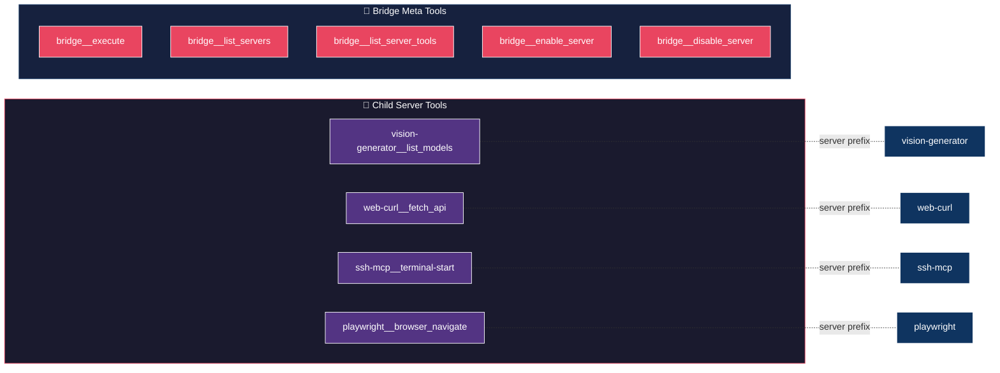

### Why this matters

- 🚫 Avoids name collisions between servers
- 👀 Makes tool origin obvious at a glance
- 🧰 Keeps remote clients easier to debug
- 📈 Scales better as more servers are added
- 🛰️ Gives the bridge its own namespace for management tools

---

## 💡 Examples

### Enable a server and use it immediately

```
You: "Enable vision-generator on the bridge."

AI: → bridge__enable_server { "server": "vision-generator" }

Bridge: "Enabled \"vision-generator\". Config updated at /path/to/default.json."

AI: "Let me generate an image now."

AI: → bridge__execute {
      "server": "vision-generator",
      "tool": "generate_image",
      "args": {
        "model": "gpt-image-2",
        "prompt": "A cyberpunk city at night",
        "output": { "directory": "C:/Users/rayss/ZCodeProject" }
      }
    }

Bridge: (returns 1:1 response from vision-generator with image data)
```

### Explore a server's tools

```
You: "What tools does web-curl have?"

AI: → bridge__list_server_tools { "server": "web-curl" }

Bridge: {
  "server": "web-curl",
  "toolCount": 7,
  "tools": [
    { "name": "fetch_api", "description": "Performs a REST API request...", "inputSchema": {...} },
    { "name": "multi_search", "description": "Executes multiple Google search queries...", "inputSchema": {...} },
    ...
  ]
}
```

### Toggle servers dynamically

```
You: "Disable cpanel, I don't need it right now."

AI: → bridge__disable_server { "server": "cpanel" }

Bridge: "Disabled \"cpanel\". Config updated."

AI: "Done. cpanel is stopped. Its 171 tools are no longer exposed."

---

You: "Okay, turn it back on."

AI: → bridge__enable_server { "server": "cpanel" }

Bridge: "Enabled \"cpanel\". Config updated."

AI: "cpanel is back. You can use it now."
```

---

## 📁 Project structure

```mermaid
graph TB
    subgraph Root["📁 MCP_Bridge"]
        direction TB
        R1["config/"]
        R2["src/"]
        R3["tools/"]
        R4["package.json"]
        R5["README.md"]
    end

    subgraph Config["📁 config"]
        direction TB
        C1["default.json<br/><i>Real config (gitignored)</i>"]
        C2["default.example.json<br/><i>Sanitized template</i>"]
        C3["README.md<br/><i>Setup guide</i>"]
    end

    subgraph Src["📁 src"]
        direction TB
        S1["index.js<br/><i>Main server, auth, watcher</i>"]
        S2["config.js<br/><i>CLI args, config loading</i>"]
        S3["childServers.js<br/><i>Lifecycle, tool map, health</i>"]
        S4["router.js<br/><i>5 meta tools</i>"]
        S5["cli/<br/><i>Launcher</i>"]
    end

    subgraph Tools["📁 tools"]
        direction TB
        T1["cloudflared.exe<br/><i>Tunnel helper</i>"]
    end

    R1 --> Config
    R2 --> Src
    R3 --> Tools

    style Root fill:#0f3460,stroke:#533483,color:#fff
    style Config fill:#1a1a2e,stroke:#e94560,color:#fff
    style Src fill:#16213e,stroke:#0f3460,color:#fff
    style Tools fill:#1a1a2e,stroke:#e94560,color:#fff
    style R1 fill:#533483,stroke:#fff,color:#fff
    style R2 fill:#533483,stroke:#fff,color:#fff
    style R3 fill:#533483,stroke:#fff,color:#fff
    style R4 fill:#533483,stroke:#fff,color:#fff
    style R5 fill:#533483,stroke:#fff,color:#fff
    style C1 fill:#e94560,stroke:#fff,color:#fff
    style C2 fill:#533483,stroke:#fff,color:#fff
    style C3 fill:#533483,stroke:#fff,color:#fff
    style S1 fill:#e94560,stroke:#fff,color:#fff
    style S2 fill:#533483,stroke:#fff,color:#fff
    style S3 fill:#533483,stroke:#fff,color:#fff
    style S4 fill:#e94560,stroke:#fff,color:#fff
    style S5 fill:#533483,stroke:#fff,color:#fff
    style T1 fill:#533483,stroke:#fff,color:#fff
```

### Important files

| File | Purpose |
|---|---|
| `src/index.js` | Main HTTP server, session handling, auth, routes, config watcher |
| `src/config.js` | CLI argument parsing and config loading |
| `src/childServers.js` | Child server lifecycle, tool map, health check, enable/disable persistence, `getToolsForServer()` |
| `src/router.js` | Gateway MCP server with 5 meta tools (`list_servers`, `disable_server`, `enable_server`, `execute`, `list_server_tools`) |
| `src/cli/ui.js` | Interactive launcher with prompts |
| `src/cli/launch.js` | Process spawner for gateway & tunnel |
| `config/default.json` | Main config (gitignored — contains your secrets) |
| `config/default.example.json` | Sanitized template — safe to commit |

---

## ⚡ Quick start

```mermaid
flowchart LR
    subgraph Setup["📦 Setup"]
        S1["1. npm install"]
        S2["2. cp config/default.example.json config/default.json"]
        S3["3. Edit config/default.json"]
    end

    subgraph Run["🚀 Run"]
        R1["4. npm start"]
        R2["5. Check /health"]
    end

    subgraph Use["🎯 Use"]
        U1["6. Call bridge__execute"]
        U2["7. Enable/disable servers"]
    end

    S1 --> S2
    S2 --> S3
    S3 --> R1
    R1 --> R2
    R2 --> U1
    U1 --> U2

    style Setup fill:#1a1a2e,stroke:#e94560,color:#fff
    style Run fill:#16213e,stroke:#0f3460,color:#fff
    style Use fill:#0f3460,stroke:#533483,color:#fff
    style S1 fill:#533483,stroke:#fff,color:#fff
    style S2 fill:#533483,stroke:#fff,color:#fff
    style S3 fill:#533483,stroke:#fff,color:#fff
    style R1 fill:#533483,stroke:#fff,color:#fff
    style R2 fill:#533483,stroke:#fff,color:#fff
    style U1 fill:#e94560,stroke:#fff,color:#fff
    style U2 fill:#e94560,stroke:#fff,color:#fff
```

### 1. Install dependencies

```bash
npm install
```

### 2. Create your config

```bash
cp config/default.example.json config/default.json
```

Edit `config/default.json` and replace placeholders with your real values.

### 3. Start the gateway

```bash
npm start
```

### 4. Check health

```text
http://127.0.0.1:8787/health
```

### 5. Use bridge__execute

Call `bridge__execute` via your MCP client to interact with any child server.

---

## 💻 CLI usage

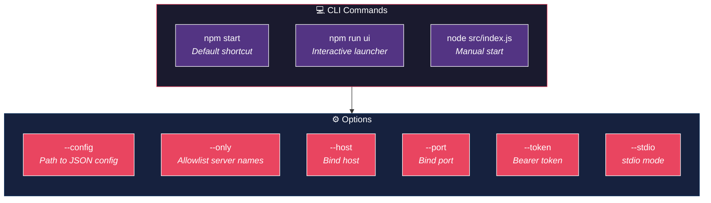

### Default shortcut

```bash
npm start
```

### Interactive launcher

```bash
npm run ui
```

### Manual examples

```bash
node src/index.js --config config/default.json
node src/index.js --config config/default.json --only vision-generator,web-curl
node src/index.js --config config/default.json --host 127.0.0.1 --port 8787
node src/index.js --config config/default.json --token SECRET123
```

### Supported options

| Option | Description |
|---|---|
| `--config` | Path to the JSON config |
| `--only` | Comma-separated allowlist of server names |
| `--host` | Host to bind the HTTP server |
| `--port` | Port to bind the HTTP server |
| `--token` | Optional bearer token for `/mcp` |
| `--stdio` | Run as stdio MCP server (no HTTP) |

---

## 🧾 Configuration format

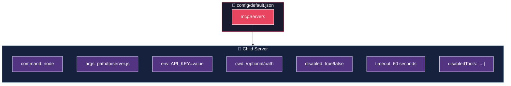

### Supported fields

| Field | Meaning |
|---|---|
| `command` | Executable to run |
| `args` | Command arguments |
| `env` | Environment variables for that child process |
| `cwd` | Optional working directory |
| `disabled` | If `true`, the bridge skips that server |
| `timeout` | Per-server startup timeout in **seconds** (default 60) |
| `disabledTools` | Array of tool names to hide from the exposed list |

---

## 🌐 Endpoints

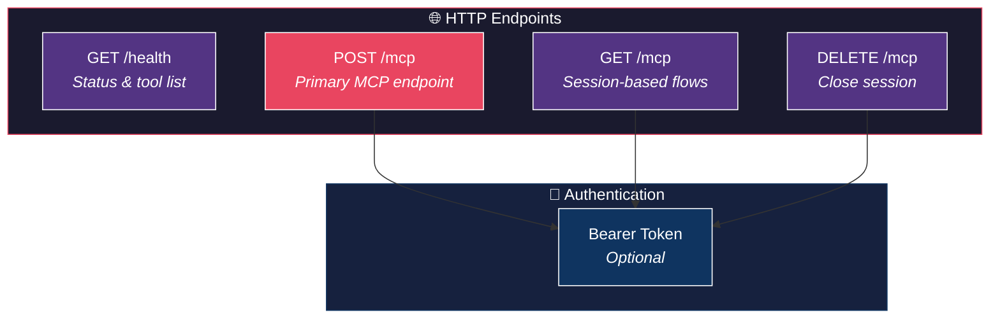

### `GET /health`

Returns a status summary with loaded servers, skipped servers, and tool list.

### `POST /mcp`

Primary MCP Streamable HTTP endpoint. Exposes the merged tool list (child servers + bridge meta tools).

### `GET /mcp`

Used for session-based MCP flows.

### `DELETE /mcp`

Closes an active MCP session.

---

## 🔐 Security notes

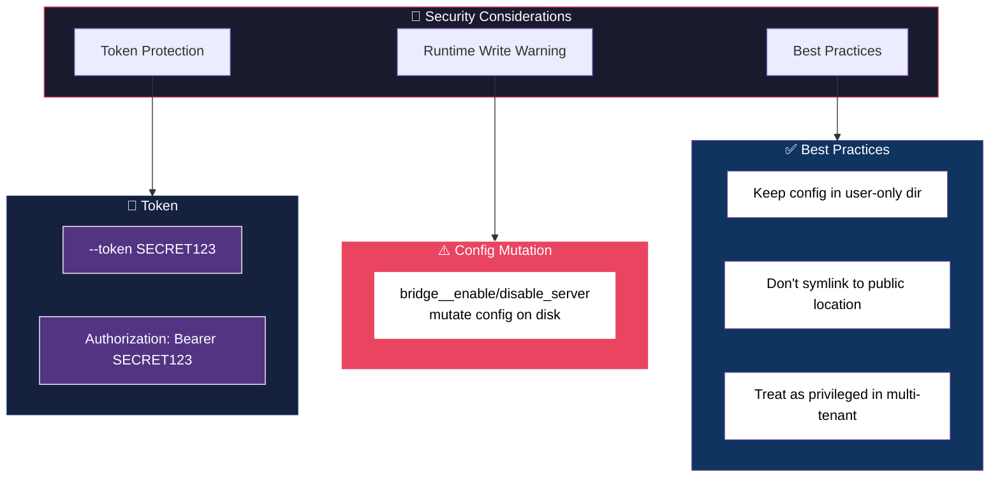

### Token protection

```bash
node src/index.js --config config/default.json --token SECRET123
```

Clients need: `Authorization: Bearer SECRET123`

### ⚠️ Runtime write warning

`bridge__disable_server` and `bridge__enable_server` **mutate your config file on disk**. Consider:

- 🔒 Keep config in user-only directory
- 🚫 Don't symlink to public location
- 🛡️ Treat as privileged in multi-tenant setups

---

## 🛠️ Troubleshooting

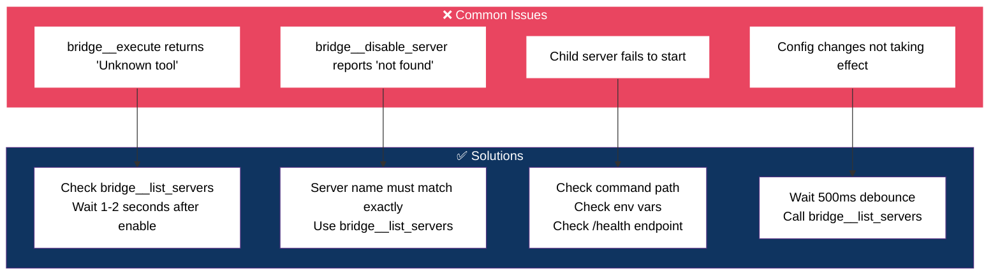

---

## 🧠 Design principles

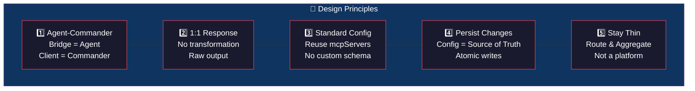

### 1. Agent-Commander pattern

The bridge is the **agent** that manages all child server sessions. The client is the **commander** that sends instructions through `bridge__execute`. This decouples the client from individual server tool lists.

### 2. 1:1 Response

`bridge__execute` returns the response **exactly as-is** from the child server. No data transformation, no format changes.

### 3. Standard Config

Reuse `mcpServers` instead of forcing a custom config system.

### 4. Persist Changes

When you toggle a server, the change is written to the config file. The file is the source of truth.

### 5. Stay Thin

The bridge should route, aggregate, expose, and let you toggle. It should not become a full platform.

---

## 🗺️ Roadmap ideas

- 📜 Richer structured logging
- 🔑 Better auth defaults
- 🗂️ Config profiles for different tool sets
- 🌐 Named tunnel support for stable URLs
- 📊 Optional metrics or request tracing
- ⏱️ Per-tool rate limiting
- 🪪 Audit log for meta-tool invocations

---

## ✅ Summary

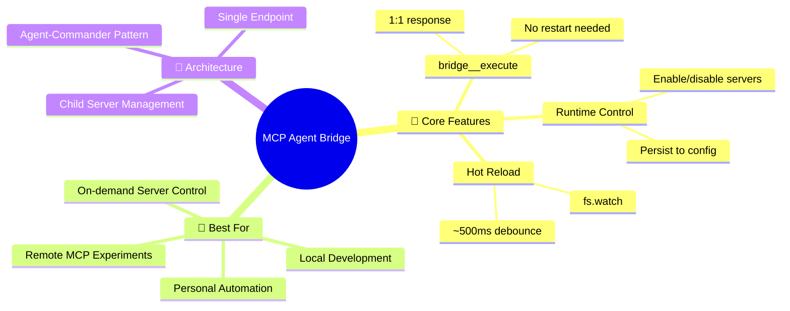

`MCP Agent Bridge` is a practical **agent gateway** that turns multiple local MCP servers into one clean remote MCP endpoint — with runtime control, persistent toggling, and the powerful `bridge__execute` tool.

**Best suited for:**
- 🛠️ Local development
- 🤖 Personal automation stacks
- 🧪 Remote MCP experiments
- 🪶 Lightweight gateway scenarios
- 🎛️ On-demand server control without restarts

---

## 📄 License

Not specified yet.
